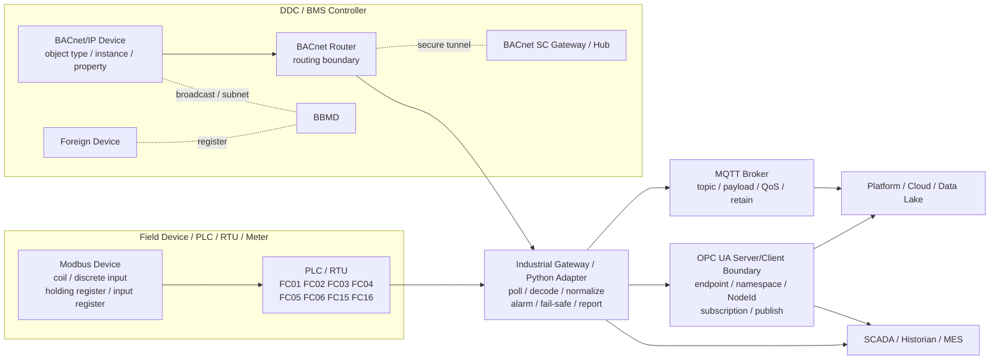
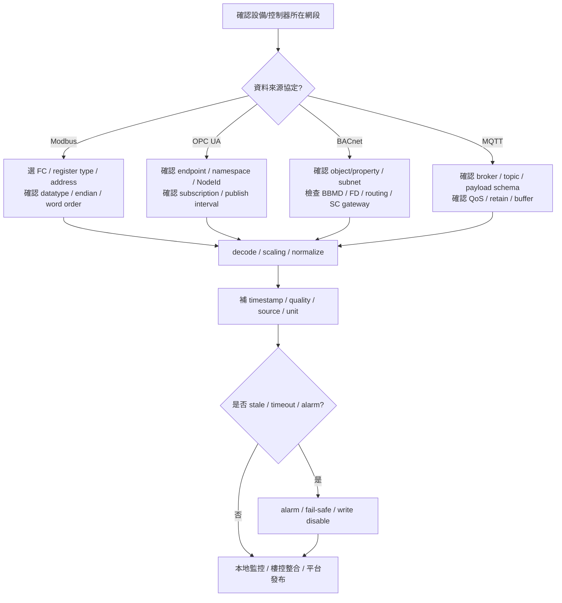

# 四種工業協定同圖工程地圖專業報告

- 報告日期：2026-05-16
- 完整報告時間：2026-05-16 13:38:05 CST
- 報告角色：資深工程師 / 工業通訊與整合架構審查
- 報告定位：工程決策與整合部署專業報告
- 涵蓋協定：`Modbus` / `OPC UA` / `BACnet` / `MQTT`

## 1. Overview

本報告的目標，不是把四種工業協定拆成四篇獨立 API 教學，而是把它們放回同一個工業/樓控專案的工程地圖內，說清楚各自所在的網路位置、責任邊界、部署重點、速度感知與常見誤判。

核心結論如下：

- `Modbus` 最常落在設備採集層，重點是 `FC`、`register/coil`、`datatype`、`word order`。
- `OPC UA` 最常落在語意模型與 SCADA / MES 整合層，重點是 `NodeId`、`namespace`、`subscription`。
- `BACnet` 最常落在樓宇自控與 BMS 網路層，重點不只在 `object/property`，也在 `BBMD`、`foreign device`、`routing`、`BACnet SC`。
- `MQTT` 最常落在 uplink 與訊息分發層，重點是 `topic`、`payload schema`、`QoS` 與 broker 行為。

這四種協定在真實專案中通常是共存關係，而不是互斥關係。正確做法是先定義誰負責設備採集、誰負責語意建模、誰負責樓控整合、誰負責平台發布，再決定程式實作與通訊治理方式。

## 2. Architecture

### 2.1 工程定位

| 協定 | 主要工程位置 | 主要責任 |
|---|---|---|
| `Modbus` | Field device / PLC / RTU / meter 採集邊界 | 讀寫 bit / register，取得現場原始資料 |
| `OPC UA` | SCADA / historian / MES / edge semantic integration | 提供語意節點模型、訂閱更新、跨系統一致命名 |
| `BACnet` | DDC / BMS / building automation subnet | 提供樓控 object/property 模型與跨子網路整合 |
| `MQTT` | Edge uplink / broker / platform integration | 提供發布/訂閱式資料分發與事件上送 |

### 2.2 主工程地圖



### 2.3 架構解讀

- `Modbus` 靠近設備原始資料邊界，最擅長直接讀取寄存器與線圈狀態，但不天然提供高階語意模型。
- `OPC UA` 靠近 SCADA / historian / MES 的資料語意層，重點是穩定的 `NodeId` 與 subscription 行為。
- `BACnet` 靠近樓控網路與 building automation 拓樸，整合成敗很常取決於 `subnet`、`BBMD`、`FD`、`routing` 與 `BACnet SC` 設計，而不只在點位本身。
- `MQTT` 靠近發布/訂閱與平台整合層，通常承載的是已正規化後的資料，不是原始設備位址模型。

## 3. Engineering Map

### 3.1 同一專案中的責任切分

| 工程層 | 典型系統 | 主要協定 | Python 最適合扮演的角色 |
|---|---|---|---|
| 設備採集層 | meter / VFD / PLC / RTU | `Modbus` | poller、decoder、register mapper |
| 樓控整合層 | DDC / BMS / HVAC | `BACnet` | gateway、integration adapter、report bridge |
| 語意整合層 | SCADA / historian / MES | `OPC UA` | client、agent、normalizer |
| 平台發布層 | broker / cloud / analytics | `MQTT` | publisher、subscriber、buffer manager |

### 3.2 控制與觀測的邊界

工業專案不應把 command path 與 telemetry path 混為一談：

- `telemetry path`：重點是資料完整性、時間戳、品質碼與可追蹤性。
- `command path`：重點是 interlock、權限、寫入安全、timeout、retry 上限與 fail-safe。

因此即使 `Modbus FC05 / FC06 / FC15 / FC16`、`BACnet WriteProperty` 或其他協定具備寫入能力，也不代表可直接把它們放進和觀測相同的預設流程。

## 4. Workflow

### 4.1 工業資料流與協定決策流程



### 4.2 流程重點

- `Modbus` 先決定 `FC` 與資料區，再談 decode。
- `OPC UA` 先決定 `NodeId` 與 subscription，不要只記 display name。
- `BACnet` 先確認 `object/property` 與網路拓樸，不要只關心 local subnet 可不可以看到點。
- `MQTT` 先定義 `topic/payload` 契約，不要只測 broker 連線成功就當交付完成。

## 5. Modbus FC Implementation

### 5.1 FC 類型總表

| 類型 | FC | 名稱 | 常見資料區 | 讀/寫 | 資料單位 |
|---|---|---|---|---|---|
| Bit Read | `FC01` | Read Coils | coil | 讀 | bit |
| Bit Read | `FC02` | Read Discrete Inputs | discrete input | 讀 | bit |
| Word Read | `FC03` | Read Holding Registers | holding register | 讀 | 16-bit register |
| Word Read | `FC04` | Read Input Registers | input register | 讀 | 16-bit register |
| Bit Write | `FC05` | Write Single Coil | coil | 寫 | bit |
| Word Write | `FC06` | Write Single Register | holding register | 寫 | 16-bit register |
| Bit Write | `FC15` | Write Multiple Coils | coil | 寫 | bit array |
| Word Write | `FC16` | Write Multiple Registers | holding register | 寫 | register array |

### 5.2 工程實作必記欄位

每一個 Modbus 點位契約至少要記錄：

- `function code`
- `register type`
- `register address`
- `quantity`
- `datatype`
- `endian`
- `word order`
- `scaling`
- `engineering unit`

若缺少上述任一欄位，現場就很容易出現「通訊成功但值錯」的假成功狀態。

### 5.3 FC03、FC04、FC06、FC16 的實務差異

| 項目 | 實務重點 |
|---|---|
| `FC03` | 最常用來讀 `holding register`，常見於可配置或可映射的工程值讀取 |
| `FC04` | 讀 `input register`，不應假設與 `FC03` 可互換，必須依設備文件定義 |
| `FC06` | 單一 register 寫入，適合單點設定，但不適合需要成組一致性的多寄存器更新 |
| `FC16` | 多寄存器成組寫入，較適合需要整體一致性的參數更新與 32-bit/多欄位寫入 |

### 5.4 常見實作誤區

| 問題 | 常見原因 | 處理方式 |
|---|---|---|
| `FC03` 成功但值不合理 | `word order`、`signedness`、`scale` 錯誤 | 先核對 datatype 與 decode 規則 |
| `FC04` 讀不到資料 | 目標點其實定義在 `holding register` | 回查設備點表與資料區 |
| `FC06` 寫入後結果異常 | 目標設備需要成組寫入 | 改用 `FC16` 並統一寫入邏輯 |
| `FC05/FC15` 寫入沒作用 | 寫錯 coil 位址或被控制邏輯覆寫 | 先查 interlock 與權限流程 |

### 5.5 Python/Gateway 實作流程

```text
選定 FC
  -> 確認 register/coil 類型
  -> 確認 address / quantity
  -> 確認 datatype / endian / word order
  -> decode / scaling
  -> 補 timestamp / quality / source
  -> 判斷 alarm / fail-safe
  -> 轉成 OPC UA node / BACnet object / MQTT payload
```

### 5.6 安全原則

- 任何 `FC05 / FC06 / FC15 / FC16` 都必須定義 timeout、retry 上限、alarm 與 fail-safe。
- command path 與 telemetry path 必須分離。
- 沒有 `FC + address + datatype + word order`，不要宣稱點位已定義完成。

## 6. OPC UA Role

### 6.1 工程定位

`OPC UA` 最適合做語意一致的跨系統整合。它回答的不是「某個 bit 在哪裡」，而是「這筆資料在系統內是什麼節點、什麼語意、如何穩定被訂閱」。

### 6.2 必講欄位

- `endpoint URL`
- `namespace`
- `NodeId`
- `Security=None` 可作教學預設，但正式場域需依資安政策調整
- `subscription / publish`
- `keepalive / reconnect`

### 6.3 工程重點

| 項目 | 說明 |
|---|---|
| 位址核心 | 必須記 `NodeId`，不要只記 display name |
| 更新模式 | 常用 `subscription + publish`，通常比純 polling 更符合語意資料流 |
| Python 角色 | client、bridge、integration agent、payload normalizer |
| 常見誤判 | 把 OPC UA 當成只是「另一種 TCP 讀值 API」 |

## 7. BACnet Network and SC Role

### 7.1 資料模型

`BACnet` 的基本識別方式是：

- `object type`
- `object instance`
- `property`

只記點位顯示名稱，不記 `object type / object instance / property`，會讓後續整合與維運失去穩定依據。

### 7.2 BACnet/IP 部署重點

| 項目 | 工程重點 |
|---|---|
| local subnet discovery | 同網段常可直接 discovery，但這不代表跨網段也會成功 |
| broadcast domain | discovery 與部分流量受 broadcast domain 影響 |
| `BBMD` | 用來在跨 subnet 的 BACnet/IP 網路中處理 broadcast distribution |
| `foreign device` | 非本地 subnet 的 client/gateway 需要透過 FD registration 參與 BACnet/IP 網路 |
| `routing` | 跨 network number / router 邊界時，必須把 BACnet routing 視為部署一級議題 |

### 7.3 BACnet SC

`BACnet SC` 不是 `BACnet/IP` 的同義字，而是安全連線拓樸的一部分。它比較適合用在需要受控安全通道、遠端站點整合、或不適合直接暴露傳統 BACnet/IP 網路的場景。

建議架構可寫成：

```text
BACnet/IP
  +
BACnet SC Gateway
  +
受控安全通道 / Hub
```

### 7.4 BACnet 的 Python 角色

Python 在這一層最適合扮演：

- gateway
- integration adapter
- report/export bridge

不應假設 Python 直接取代全部 DDC / BMS 控制核心。

### 7.5 BACnet 專案常見誤判

| 問題 | 常見誤判 | 實際應查項目 |
|---|---|---|
| 找不到設備 | 以為是點位名寫錯 | 先查 `subnet / router / BBMD / FD` |
| 跨網段看不到 device | 以為 local test 成功就代表全站可用 | 先查 `routing` 與 broadcast path |
| 遠端整合不穩 | 只把 BACnet/IP 暴露出去 | 先評估 `BACnet SC` 或受控 gateway 架構 |
| 點位能讀但不穩 | 只懷疑 Python client | 先查 object/property 與網路拓樸一起看 |

## 8. MQTT Role

### 8.1 工程定位

`MQTT` 最常作為 uplink 與訊息分發層，不負責原始設備位址模型，也不天然提供 PLC/DDC/BMS 的本體語意。

### 8.2 必講欄位

- `broker`
- `topic`
- `payload schema`
- `QoS`
- `retain`
- `offline buffer / store-and-forward`

### 8.3 工程重點

| 項目 | 說明 |
|---|---|
| 識別方式 | `topic + payload`，不是固定寄存器或 object |
| 更新模式 | `publish / subscribe` |
| Python 角色 | publisher、subscriber、buffer manager |
| 常見誤判 | broker 連上就以為資料契約完成，忽略 quality / timestamp / unit |

## 9. Communication Comparison

### 9.1 工程架構比較表

| 協定 | 典型網路位置 | 主要對接系統 | 資料模型 | 互動方式 | 部署關鍵 | 最常見誤判 | Python 最常扮演角色 |
|---|---|---|---|---|---|---|---|
| `Modbus` | field device / PLC / RTU 採集邊界 | meter、VFD、PLC、RTU | coil / register | polling + read/write | `FC`、位址、datatype、word order、timeout | 以為連上就代表讀對 | poller、decoder、mapper |
| `OPC UA` | SCADA / historian / MES / semantic layer | SCADA、MES、integration hub | node / namespace / `NodeId` | session + subscription | endpoint、`NodeId`、publish、keepalive | 只記 display name | client、bridge、normalizer |
| `BACnet` | BMS / DDC / BACnet/IP subnet / SC boundary | HVAC、BMS、building automation | object / property | request-response、部分場景 COV | `BBMD`、`foreign device`、`routing`、`BACnet SC` | 只記 object name、不看 subnet/router | gateway、integration adapter |
| `MQTT` | broker / edge uplink / platform | broker、cloud、analytics | topic / payload | publish / subscribe | schema、QoS、retain、buffer | 只看 broker，不看資料契約 | publisher、subscriber、buffer manager |

### 9.2 通訊格式與實作比較表

| 協定 | 識別方式 | 核心互動單位 | 典型操作 | 實作時必記欄位 | 推送/輪詢特性 | 常見錯誤 |
|---|---|---|---|---|---|---|
| `Modbus` | `FC + register/coil address` | bit / 16-bit register | `FC03`、`FC16` 為主，視場景使用 `FC01/FC02/FC04/FC05/FC06/FC15` | address、register type、datatype、endian、word order、scaling | 以 polling 為主 | offset、signedness、endianness、scan 過快 |
| `OPC UA` | `NodeId` | typed node | browse、read、subscription | endpoint、namespace、`NodeId`、sampling/publish | 訂閱能力強 | 只記顯示名稱、不管 session/queue |
| `BACnet` | `object type + object instance + property` | object/property | read property、write property、discovery、COV | device、object、property、subnet、routing、`BBMD`、`FD`、`SC` | 以 request-response 為主，部分可 COV | 跨 subnet discovery 失敗、忽略 routing/TTL |
| `MQTT` | topic | message payload | publish、subscribe、retain | topic、payload schema、QoS、timestamp、quality | 天然 publish/subscribe | topic 扁平化、payload 欄位治理不足 |

### 9.3 通訊速度與即時性比較表

> 本表比較的是工程感知速度與即時性特徵，不是脫離場景的實驗室基準跑分。

| 協定 | 典型更新模式 | 工程感知速度 | 延遲主要來源 | 高頻更新適配性 | 吞吐擴展特性 | 速度比較注意事項 |
|---|---|---|---|---|---|---|
| `Modbus` | polling | 低到中，取決於 polling interval、device response、segment loading | 輪詢週期、serial/TCP timeout、逐站掃描 | 有限，點數增多時惡化明顯 | 受單站回應與輪詢模型限制 | 不能只看單點速度，要看整段輪詢週期 |
| `OPC UA` | subscription + publish | 中到高，適合事件化與連續更新 | sampling interval、publish interval、queue、server load | 通常優於純 polling | 取決於 server、subscription 設計與 session 管理 | 不是所有 OPC UA server 都能高頻穩定運行 |
| `BACnet` | request/response 為主，部分場景可 COV | 低到中，依 object access、network topology、router/BBMD 狀態而變 | broadcast/discovery、routing、device processing、network design | 樓控監控可用，但不應假設等同高速 stream bus | 受樓控拓樸與設備能力影響較大 | 若含跨 subnet、`BBMD`、`FD`、`SC`，速度評估必須放回拓樸中看 |
| `MQTT` | publish/subscribe | 中到高，適合 uplink 分發與事件傳播 | broker load、QoS、network path、payload size | 通常適合，但取決於 broker 與 schema 設計 | 通常優於輪詢式協定 | `MQTT` 快不代表資料源快，它常只是上行承載層 |

## 10. Protocol Speed Comparison

### 10.1 比較方法

速度比較必須綁定以下條件，否則沒有工程意義：

- 點數規模
- 輪詢週期
- server / broker / device 負載
- 網路拓樸
- `QoS / queue / publish interval`
- `BACnet subnet / router / BBMD / FD / SC`

### 10.2 工程結論

- 少量點位、單站設備下，`Modbus` 可非常直接，但當輪詢點數與設備數量增加後，延遲會快速累積。
- `OPC UA` 在需要語意化連續更新時，通常比輪詢模型更平衡。
- `BACnet` 的速度不能脫離樓控拓樸來看；`routing`、`BBMD`、`FD` 與 `BACnet SC` 架構都會影響結果。
- `MQTT` 常在分發層表現靈活，但它不等於原始設備採集協定本體。

## 11. Troubleshooting

| 問題 | 先查什麼 | 不要先做什麼 |
|---|---|---|
| `Modbus` 看起來很慢 | 輪詢點數、scan cycle、timeout、站點數量 | 不要先怪 socket library |
| `FC03` 有值但結果怪 | `word order`、datatype、scaling、signedness | 不要先改上層業務邏輯 |
| `OPC UA` 更新延遲高 | subscription、publish interval、queue、server load | 不要只靠高頻 polling 補救 |
| `BACnet` 看不到設備 | `subnet`、`BBMD`、`foreign device`、`routing` | 不要先假設 object name 填錯 |
| `BACnet` 遠端整合不穩 | `BACnet SC`、gateway 拓樸、router | 不要直接暴露傳統 BACnet/IP |
| `MQTT` 看起來很快但資料很舊 | 上游資料更新週期、payload timestamp、broker backlog | 不要只看 broker 是否在線 |

## 12. Best Practices

- 先定義工程角色，再定義協定，不要反過來。
- 沒有 `FC + register type + address + datatype + word order`，不要宣稱 Modbus 點位已交付。
- 沒有 `NodeId`，不要宣稱 OPC UA 契約可維護。
- 沒有 `object type / object instance / property + BBMD / FD / routing / SC`，不要宣稱 BACnet 整合已可跨網段部署。
- 沒有 `topic + payload schema + quality + timestamp`，不要宣稱 MQTT 整合已可維運。
- command path 與 telemetry path 必須分離。
- `速度` 不能脫離 `alarm`、`fail-safe`、資料品質與安全策略單獨討論。

## 13. Risk Notes

| 風險 | 說明 |
|---|---|
| 把四協定當成單純不同 port | 會導致錯誤選型與錯誤實作邊界 |
| 把 `Modbus` 當成語意資料模型 | 會忽略上層標準化與品質治理 |
| 把 `BACnet` 當成純點位讀寫協定 | 會低估 `BBMD`、`FD`、`routing`、`SC` 的部署複雜度 |
| 把 `MQTT` 的高可分發性誤解成現場採集速度 | 會做出錯誤的速度比較結論 |
| 把 command 與 telemetry 混在一起 | 會放大現場控制風險 |

## 14. Summary

四種工業協定放在同一張工程地圖時，真正重要的不是背出名詞，而是看清它們各自解的是哪一層問題：

- `Modbus` 解設備寄存器與線圈採集/寫入。
- `OPC UA` 解語意節點與連續訂閱整合。
- `BACnet` 解樓控物件模型與跨網段 building automation 拓樸。
- `MQTT` 解上行發布與訊息分發。

因此，專案落地時應優先建立：

1. 明確的協定責任矩陣
2. 穩定的位址/節點/物件/topic 契約
3. timeout、alarm、fail-safe 與資料品質治理
4. command 與 telemetry 分離
5. `BACnet BBMD / foreign device / routing / BACnet SC` 與 `Modbus FC` 的現場部署規則

只有在這些條件都被寫清楚後，四協定共存的專案才會可交付、可維運、可擴展。
